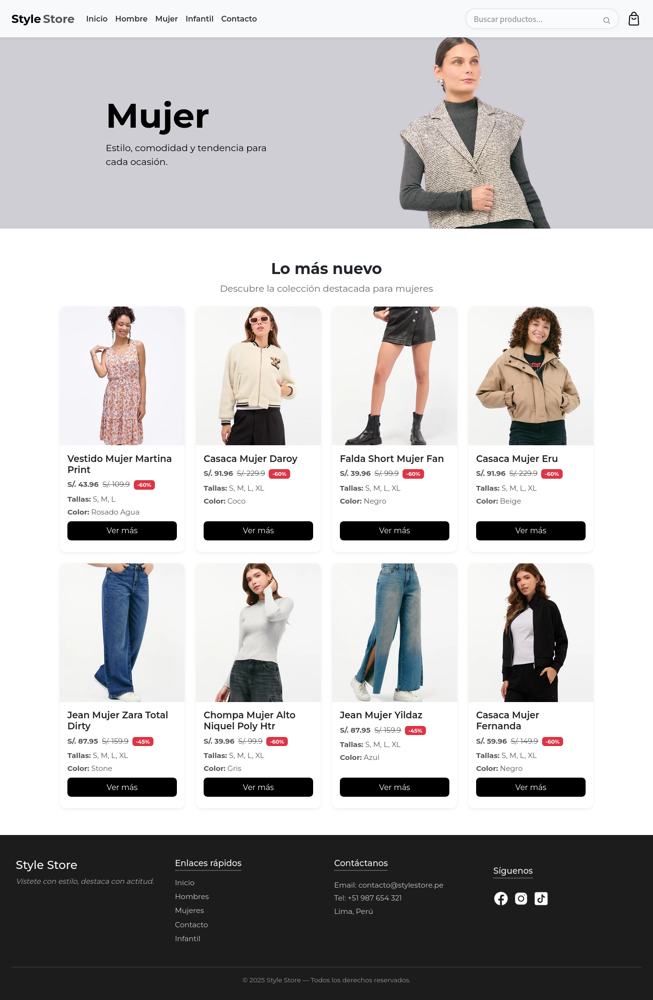
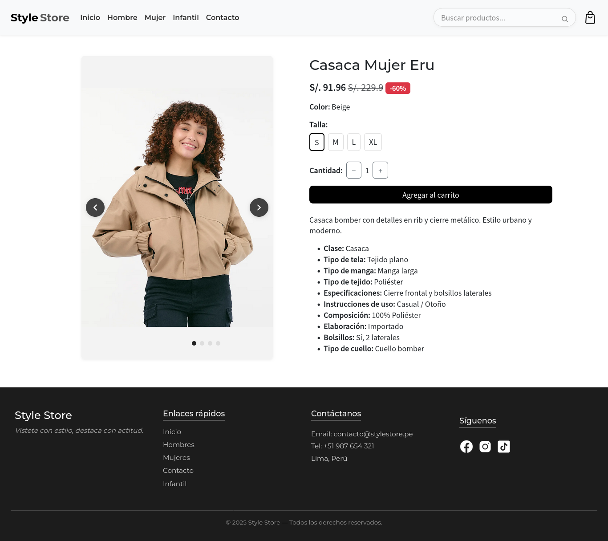
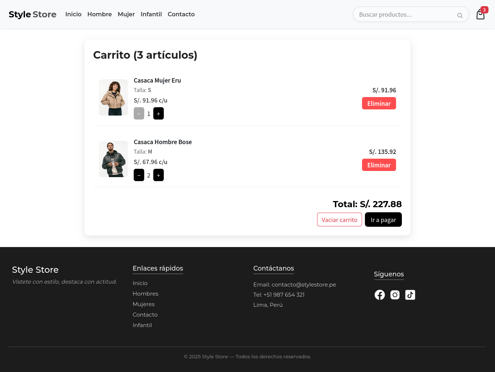
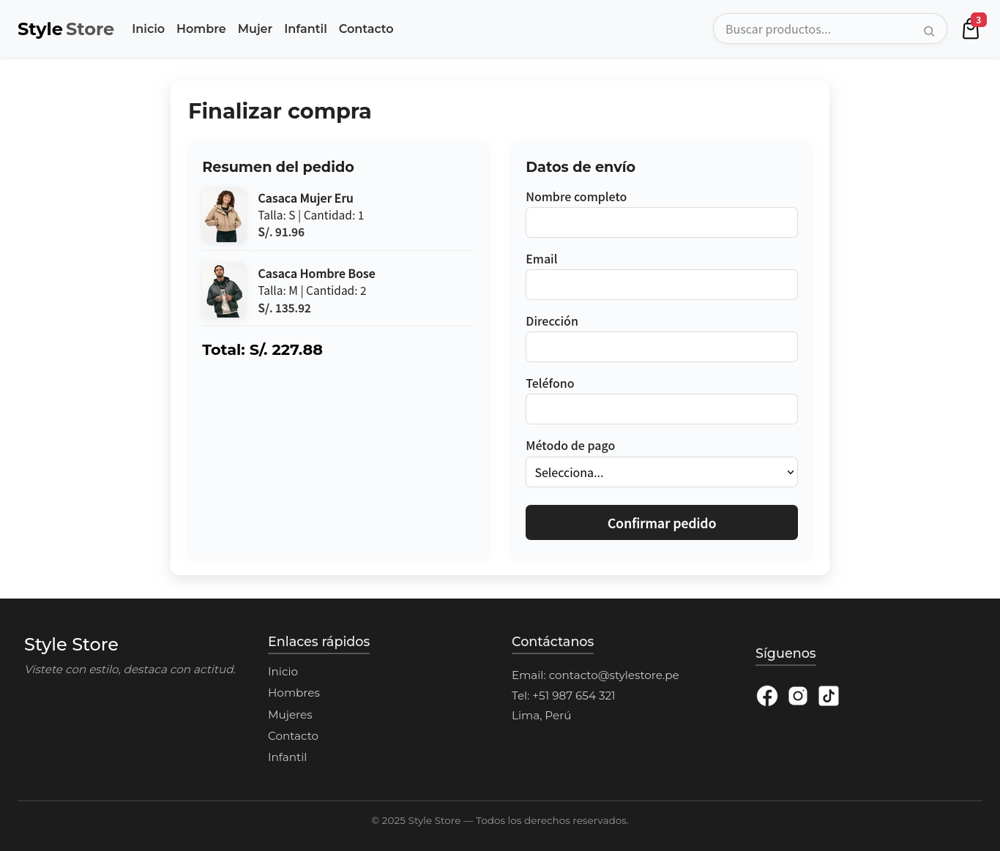
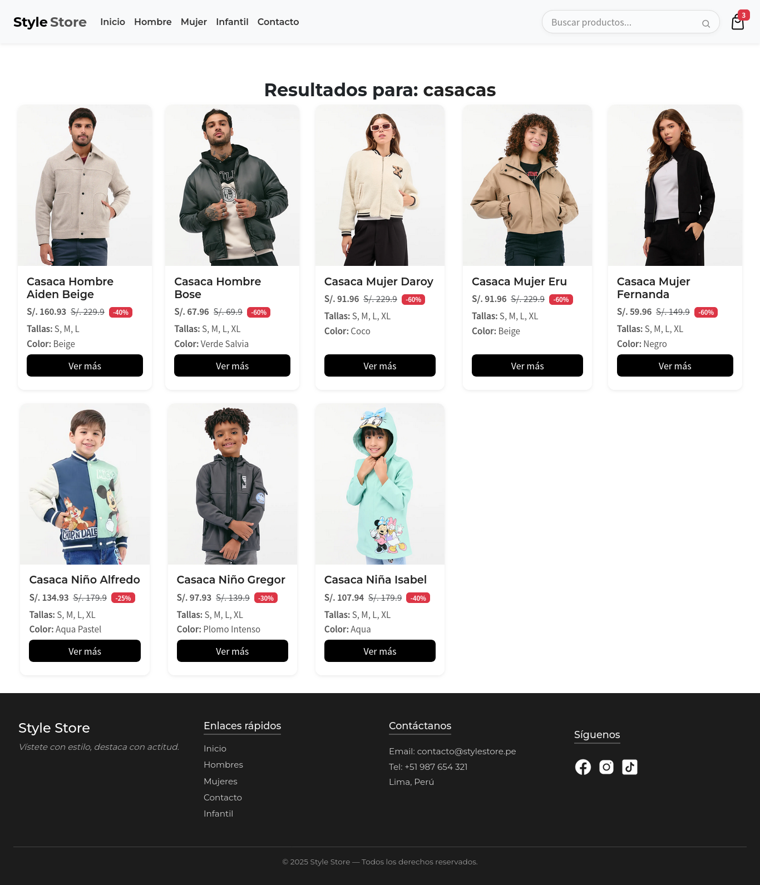

# Style Store

Proyecto SPA con React para Cibertec | Este sitio web es una tienda online de ropa

## 🚀 Características Principales

- 🔍 **Busquedas de productos** por nombre.
- 🏷️ **Catálogo de productos** con filtros por categorías.
- 📝 **Detalle del producto** con carrusel de imagenes, selección de tallas y cantidades
- 🛒 **Carrito de compras** interactivo.
- 💳 **Checkout** (Datos de envío y métodos de pago).
- 📱 **Diseño responsive** para móviles y desktop.
- 🌈 **UI moderna** con CSS.

## 📦 Instalación

```bash
# Clonar el repositorio
git clone https://github.com/antwny/Style-Store.git
cd Style-Store
# Instalar dependencias
npm install
# Inicia la aplicación:
npm run dev
```
## ✉️ Contacto

[](https://www.youtube.com/@antwny)
[](https://www.instagram.com/antw.ny/)
[](https://www.linkedin.com/in/luis-antony-atalaya-benites-b2b16b1ab/)

⭐ ¡Si te gusta el proyecto, déjale una estrella en GitHub!

## 🖥️ Capturas de Pantalla
### Inicio

### Catálogo de Mujeres

### Detalle de Producto

### Carrito de compras

### Checkout

### Busquedas

